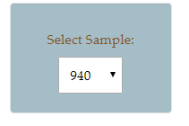
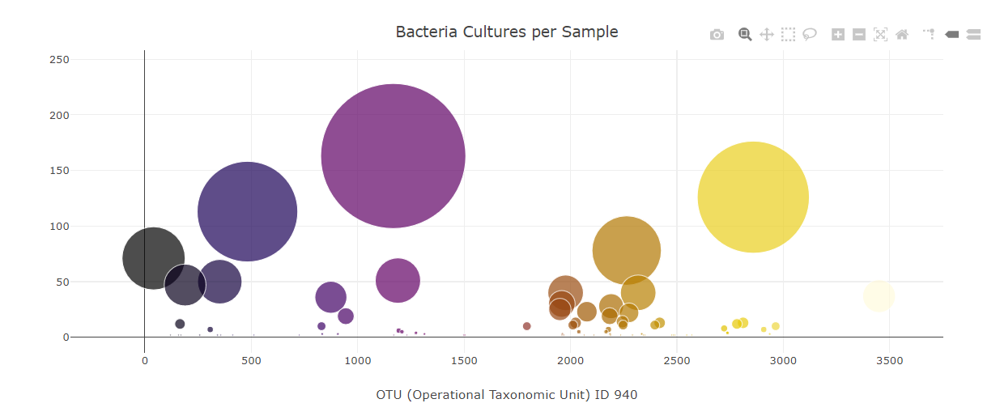
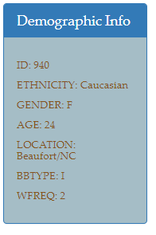
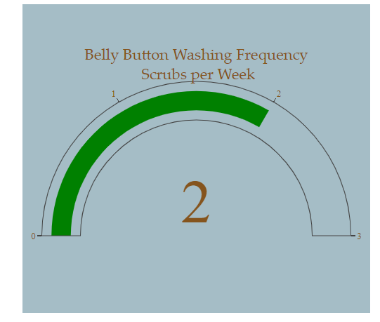
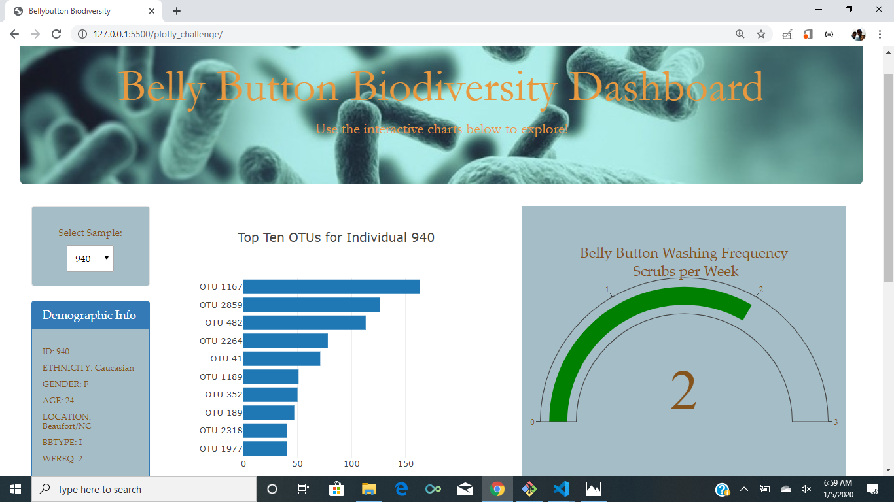

# PLotly Challenge: Interactive Visualizations and Dashboard

- Used Flask to design an API for belly button biodiversity dataset and to serve the HTML and JavaScript required for my dashboard page. 

- Used Plotly.js and DOM manipulation to build interactive charts for dashboard.

- Used CSS Bootstrap and HTML for dashboard design.

- Deployed to Github: https://vgangaprasad.github.io/plotly_challenge/

Analysis of microbes that colonize human navels

I have build an interactive dashboard to explore the [Belly Button Biodiversity dataset](http://robdunnlab.com/projects/belly-button-biodiversity/), which catalogs the microbes that colonize human navels.

The dataset reveals that a small handful of microbial species (also called operational taxonomic units, or OTUs, in the study) were present in more than 70% of people, while the rest were relatively rare.

# Here are the steps that I followed:

## Step 1: Plotly

1. Used D3 library to read in `samples.json` and add the id in a dropdown that can used to select different ID's

2. Created a horizontal bar chart with a dropdown menu to display the top 10 OTUs found in that individual.

used the following values from the JSON file for the charts:

* `sample_values` as the values for the bar chart.

* `otu_ids` as the labels for the bar chart.

* `otu_labels` as the hovertext for the chart.

  

3. Created a bubble chart that displays each sample (data from JSON)

* `otu_ids` for the x values.

* `sample_values` for the y values.

* `sample_values` for the marker size.

* `otu_ids` for the marker colors.

* `otu_labels` for the text values.

4. Displayed the sample metadata, i.e., an individual's demographic information.

5. Displayed the washing frequency of belly button in a Gauge Chart and this will be updated whenever a new sample is selected

6. Updated all of the plots any time that a new sample is selected.

7. Here is the webpage with all the data displayed in different charts

### About the Data

Hulcr, J. et al.(2012) _A Jungle in There: Bacteria in Belly Buttons are Highly Diverse, but Predictable_. Retrieved from: [http://robdunnlab.com/projects/belly-button-biodiversity/results-and-data/](http://robdunnlab.com/projects/belly-button-biodiversity/results-and-data/)
